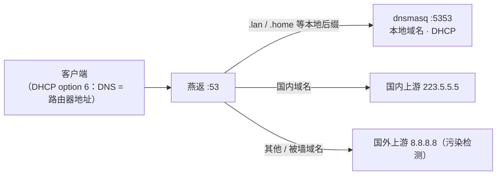
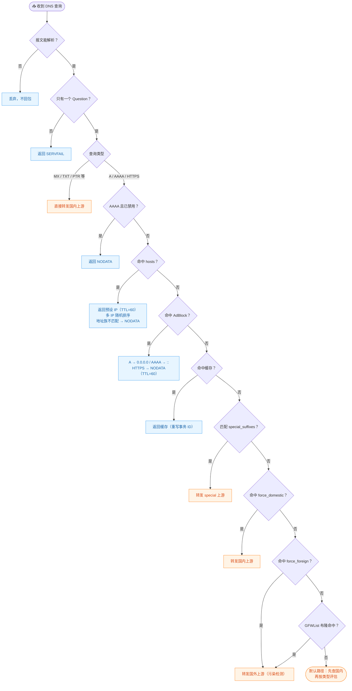
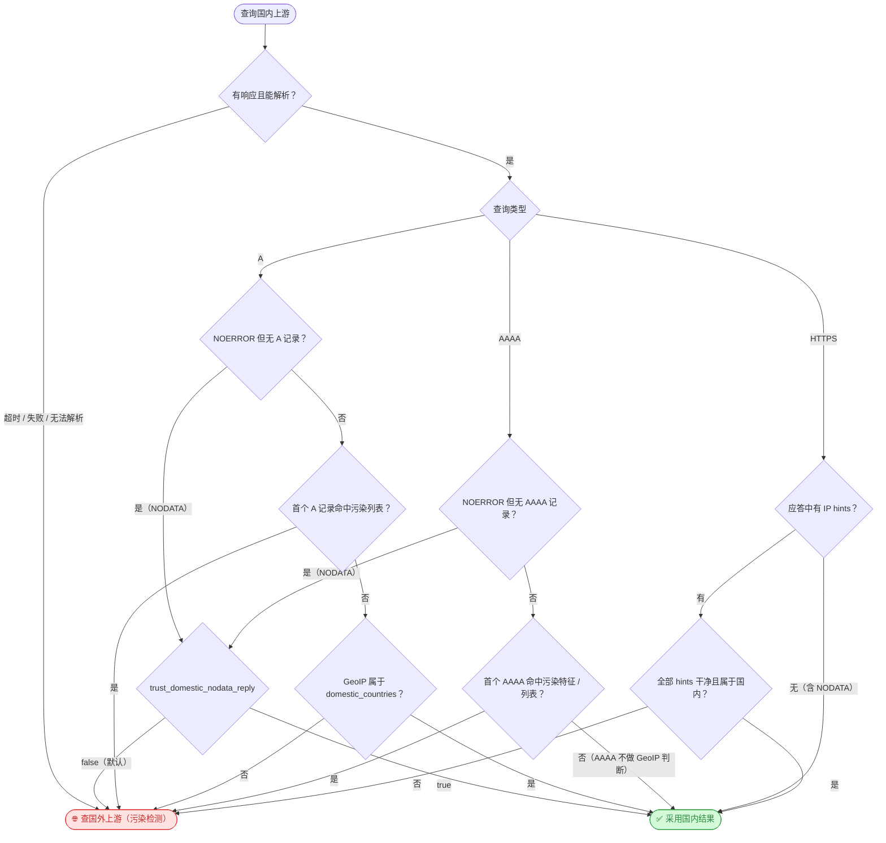
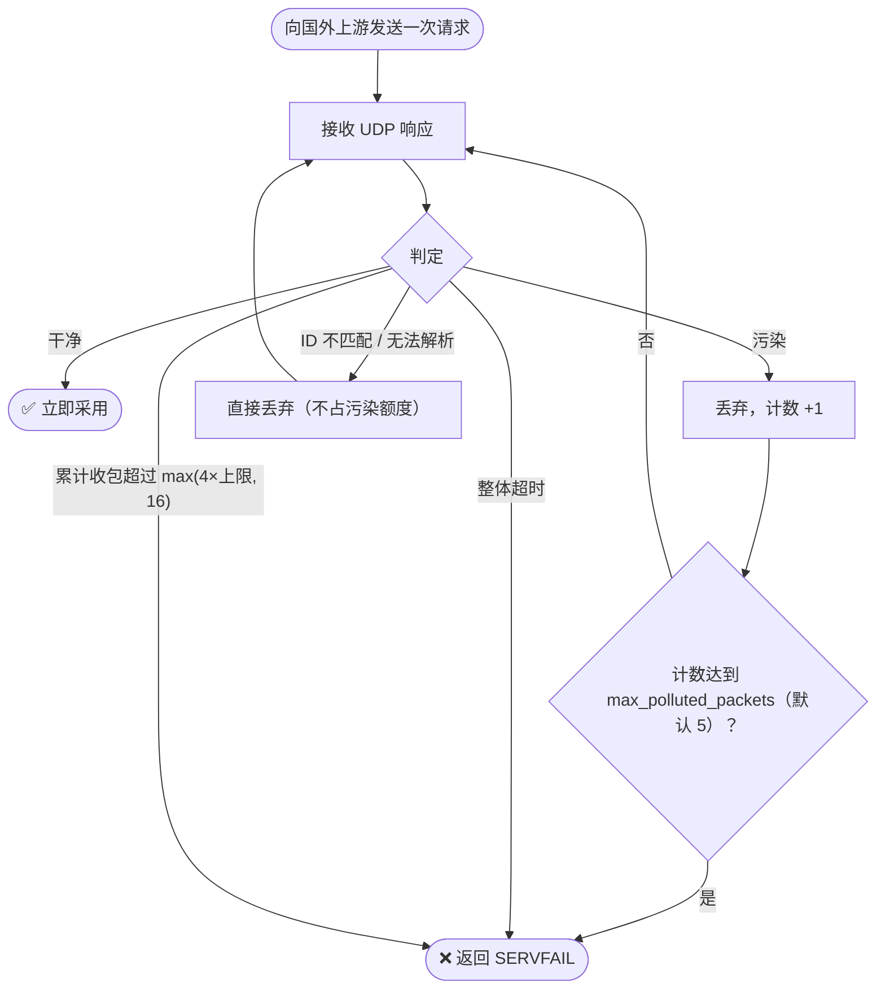

<div align="center">

# 燕返 (Tsubame Gaeshi)

*佐々木小次郎の秘剣——一撃必殺。*

**轻量级 DNS 分流工具 · 专为 OpenWrt 设计 · Rust 实现 · 二进制约 700KB**

[](LICENSE)


[快速上手](#-快速上手) · [工作流程](#-工作流程) · [功能概览](#-功能概览) · [配置参考](#-配置参考) · [命令行](#-命令行) · [编译](#-编译)

</div>

---

## 背景

在 OpenWrt 上做 DNS 分流，[mosdns](https://github.com/IrineSistiana/mosdns) 是常见的选择，功能全面、插件丰富。不过它的二进制体积在 20MB 左右，对于 flash 空间紧张的设备不太友好。

燕返采用 Rust 实现，裁剪到实际需要的功能，UPX 压缩后约 600KB。它不追求大而全，只覆盖日常分流场景中最常用的那部分。

---

## 🚀 快速上手

### 1️⃣ 准备文件

| 文件 | 必需？ | 说明 |
|---|:---:|---|
| `tsubamegaeshi-rs` | ✅ | 编译产出（或 UPX 压缩后）的二进制 |
| `GeoLite2-Country.mmdb` | ✅ | MaxMind GeoLite2 国家数据库，用于判断 IP 是否属于国内。启动时加载，缺失或损坏会直接退出 |
| `gfwlist.txt` | ➖ | Base64 编码的 GFWList 原文 |
| `adblock.txt` | ➖ | AdBlock Plus 格式的广告域名规则 |
| `ipv4.txt` / `ipv6.txt` | ➖ | 自定义污染 IP 列表（`max_polluted_packets` 大于 0 时才加载） |

建议统一放在 `/etc/tsubamegaeshi-rs/` 下。

### 2️⃣ 最小配置

新建 `config.toml`，只填必填项即可跑起来：

```toml
listen              = "0.0.0.0:53"
special_suffixes    = [".lan", ".home"]
special_upstream    = "127.0.0.1:5353"   # 本地 dnsmasq
domestic_upstream   = "223.5.5.5"
foreign_upstream    = "8.8.8.8"
mmdb_path           = "/etc/tsubamegaeshi-rs/GeoLite2-Country.mmdb"
cache_size          = 4096
enable_ipv6_aaaa    = false
```

### 3️⃣ 校验配置

```bash
# -T / --check：只检查配置合法性并打印解析后的配置（默认值已回填），不启动服务
./tsubamegaeshi-rs -c /etc/tsubamegaeshi-rs/config.toml -T
```

返回码为 0 表示合法；不合法会输出具体原因（如 `max_in_flight must be > 0`）。

### 4️⃣ 启动

```bash
./tsubamegaeshi-rs -c /etc/tsubamegaeshi-rs/config.toml
```

监听 53 端口需要 root（或 `CAP_NET_BIND_SERVICE`）。`Ctrl-C` 优雅退出（最多等待在途任务 5 秒）。

### 5️⃣ OpenWrt 部署

推荐拓扑：燕返接管 53 端口，dnsmasq 退到 5353，只管 DHCP 和本地域名解析：



改端口本身不影响 DHCP 功能，但 OpenWrt 侧需要按下面四步配干净，缺一不可：

**① dnsmasq 改到 5353 端口** —— `/etc/config/dhcp`：

```
config dnsmasq
    option port '5353'
```

**② br-lan 接口不要设置 DNS 服务器**

`/etc/config/network` 中 lan（br-lan）接口保持不设 `option dns`（LuCI：网络 → 接口 → LAN → 高级设置，「使用自定义的 DNS 服务器」留空）。接口上设置的 DNS 会被写入 `/tmp/resolv.conf.auto`，成为 dnsmasq 的上游，导致查询绕过燕返。

**③ 所有 wan / wan6 接口：改用指定 DNS 服务器，且指定值留空** —— `/etc/config/network`：

```
config interface 'wan'
    option peerdns '0'
    # 不要配置 option dns，保持为空

config interface 'wan6'
    option peerdns '0'
```

对应 LuCI：网络 → 接口 → wan / wan6 → 高级设置，取消勾选「使用对端通告的 DNS 服务器」，同时「自定义 DNS 服务器」不要填任何值。这样 `/tmp/resolv.conf.auto` 里不会混入运营商 DHCP 下发的 DNS，dnsmasq 拿不到任何公网上游，公网域名只能经燕返处理。

**④ DHCP 附加选项手动下发 DNS 服务器**

dnsmasq 改到 5353 后，不再通过 DHCP 向客户端通报 DNS 服务器（客户端会拿不到 DNS，表现为“网通了但无法解析”）。需要手动加一条 DHCP option 6，把客户端的 DNS 指到路由器 LAN 地址——也就是燕返监听的 53 端口。`/etc/config/dhcp`：

```
config dhcp 'lan'
    list dhcp_option '6,192.168.1.1'   # 换成你的路由器 LAN 地址
```

对应 LuCI：网络 → 接口 → LAN → DHCP 服务器 → 高级设置 → 「DHCP 选项」添加 `6,192.168.1.1`。

改完后重启网络服务并启动燕返：

```bash
/etc/init.d/network restart
/etc/init.d/dnsmasq restart
./tsubamegaeshi-rs -c /etc/tsubamegaeshi-rs/config.toml
```

这样 `.lan` 之类的本地后缀由 `special_suffixes` 指回 dnsmasq，公网域名全部由燕返分流；客户端通过 DHCP option 6 拿到路由器地址作 DNS，无感知接入。

### 6️⃣ 验证

```bash
# 本地域名走 dnsmasq
dig @127.0.0.1 nas.lan

# 国内域名：应返回国内 IP（日志出现 [DOMESTIC-KEEP]）
dig @127.0.0.1 www.taobao.com

# GFWList 域名：应返回真实 IP（日志出现 [GFWLIST]）
dig @127.0.0.1 www.google.com

# AAAA 默认关闭：应返回 NODATA（NOERROR 且无记录）
dig @127.0.0.1 -t AAAA www.google.com

# 再查一次同样的域名：日志出现 [CACHE-HIT]
dig @127.0.0.1 www.taobao.com
```

### ⚠️ 常见坑

| 现象 / 场景 | 原因与对策 |
|---|---|
| 启动直接退出 | `mmdb_path` 是必填项，mmdb 文件缺失或损坏会拒绝启动 |
| 改配置不生效 | 没有热加载，改完 `config.toml` 重启进程生效 |
| 启动 panic 提到 hosts | hosts 里写错了 IP；`-T` 只校验结构，不校验 IP 语法，以实际启动为准 |
| 日志刷屏 | `log_level` 缺省为 `info,tsubamegaeshi_rs=debug`，稳定运行后显式设为 `"info"` |
| marksite 不生效 | 需要系统装有 `/usr/sbin/nft` 且有执行权限；未配置 `[marksite]` 则完全不触碰 nftables |
| OpenWrt 上“网通了但客户端无法解析” | 第 ④ 步漏配 DHCP option 6（客户端没拿到 DNS），或某 wan 口没关 peerdns 导致混入运营商上游 |

---

## 🔀 工作流程

每条 DNS 查询按以下顺序处理，命中即返回：



### 默认路径：先查国内，再按类型评估

三种查询类型的评估规则各自独立：



### 国外上游查询的污染检测

发出一次请求后循环接收 UDP 响应，直到拿到干净结果或放弃：



污染判定依据三类来源：

- 内置的 `2001::` 特征地址（`2001:` 开头且中间 10 字节全零）；
- 内置的 Facebook 污染地址（借用 Meta 前缀 `2a03:2880`、后 64 位固定为 `face:b00c:0:25de` 的 30 种组合）；
- 自定义 IPv4 / IPv6 列表（`ipv4_list` / `ipv6_list`）。

> [!NOTE]
> 大部分查询在缓存或静态规则阶段就解决了；只有无缓存、无规则命中的域名才会走「国内 + 必要时国外」的完整路径，GeoIP 判断也只在国内上游确实返回 A 记录时才执行。

---

## 🛡️ GFW 抗污染

燕返的污染检测机制可在一定程度上对抗中国大陆**部分区域**的默认 DNS 污染，但效果因地区而异（例如四川有效，青岛无效）。

### 原理

GFW 的 DNS 污染采用**抢答**（inject）策略——在真实响应到达之前抢先发送伪造的 DNS 响应包。燕返利用此特性：

- 向国外上游（如 `8.8.8.8`）发送查询后，**循环接收多个 UDP 响应**
- 借助内置的污染特征库（包含 `2001::` 地址、Facebook 污染前缀等）及自定义 IP 列表识别污染包
- 丢弃污染包，继续等待真实响应，直至收到干净结果或超过 `max_polluted_packets` 上限

由于 GFW 通常仅抢答而不会完全阻断外部 DNS 流量，真实响应往往能在若干轮污染包之后顺利到达。

> [!WARNING]
> 如果你所在地区的网络策略**过滤掉污染包**（而非仅抢答），或**完全封锁了 `8.8.8.8` 等国外 DNS 服务器**，则燕返的抗污染机制将失效。此时需要配合代理工具使用。

### 性能

- RTT 约 **~70ms**（实测数据，因地区和运营商而异）
- 直连国外 DNS 服务器，无需经由代理链路转发，延迟通常优于 xray-core 等方案（将 DNS 查询转发至远程 VPS）

### ⚠️ 隐私风险

**使用前请评估泄露风险**：燕返直连国外上游时，DNS 查询内容会以明文形式暴露给上游服务器（如 Google 的 `8.8.8.8`）。若上游服务器或网络路径不可信，可能存在域名查询记录泄露的风险。

如需避免 DNS 查询内容泄露，建议使用安全的端口转发工具对流量进行加密转发，例如 [xtp-rs](https://github.com/hrimfaxi/xtp-rs)。通过端口转发工具将本地 `127.0.0.1:5354` 转发至远程 DNS 服务器（如 `8.8.8.8:53`） 后，将燕返的 `foreign_upstream` 设为 `127.0.0.1:5354` 即可。

---

## ✨ 功能概览

### 分流路由

- **Special 后缀匹配**：匹配指定后缀的域名走独立上游，适合把 `.lan`、`.home` 等本地域名交给 dnsmasq 或内网 DNS。后缀会先做规范化（去点号、转小写），写 `.lan` 或 `lan` 效果相同
- **强制国内 / 强制国外**：基于后缀的域名列表（`bilibili.com` 同时覆盖其子域名），命中后跳过所有其他判断
- **GFWList 布隆过滤器**：读取 Base64 编码的 GFWList，只提取 `||domain` 形式的规则，用布隆过滤器做内存高效的域名匹配，误判率可配置（默认 0.1%）。匹配时逐层检查父域名，因此 `||google.com` 能覆盖 `www.google.com`
- **GeoIP 兜底**：默认路径下先查国内上游，A 记录属于配置的国家（默认中国大陆，通过 MaxMind GeoLite2 判断）则直接采用；否则再查国外上游

### IPv6

- 完整支持 AAAA 查询，A 和 AAAA 路由独立决策（AAAA 默认路径不做 GeoIP，只查污染）
- 内置识别两类 GFW 污染地址：`2001::` 特征地址、借用 Meta 前缀的 Facebook 污染地址
- 可通过 `enable_ipv6_aaaa = false` 完全关闭 AAAA 查询（直接返回 NODATA，常用于规避 IPv6 不通带来的各种问题）
- 监听地址为 IPv6 时自动启用双栈（`v6only=false`），一个端口同时服务 IPv4 和 IPv6 客户端

### HTTPS (SVCB)

- 支持 HTTPS (type 65) 查询，路由逻辑与 A/AAAA 一致
- Hosts 中的 IP 会作为 SVCB `ipv4hint` / `ipv6hint` 返回
- 国内上游返回的 HTTPS 记录中的全部 hints 都要通过污染检测和 GeoIP 校验，任何一个不合格即转查国外

### 缓存

- 基于 LRU 的内存缓存，键为「域名 + 查询类型」，条目数可配置
- 只缓存 NOERROR 且含应答记录、TTL 大于 0 的响应；TTL 取应答中所有记录的最小值，到期自动淘汰
- 命中时重写 DNS 事务 ID 后回包，对客户端完全透明
- `cache_size = 0` 可整体关闭缓存

### Hosts

- 支持静态 IPv4 / IPv6 覆盖，写在配置文件中；一个域名可配多个 IP，应答时随机排序（简单的负载均衡），TTL 固定 60 秒
- 域名键做规范化处理（忽略大小写和首尾点号），规范化后重复的域名会在启动时报错
- 域名存在于 hosts 但找不到对应地址族时，返回 NODATA（而非 SERVFAIL）
- HTTPS 查询命中 hosts 时，返回包含 IP hints 的 SVCB 记录

### 广告屏蔽

- 支持加载 AdBlock 规则文件，识别 `||domain^`、`.domain` 和纯域名三种写法，自动跳过注释、`@@` 白名单和带 `$` 选项的规则
- 布隆过滤器 + 精确集合双重校验：布隆只作快速预筛，最终结果由精确集合确认，**不存在误判**；`adblock_fp_rate` 只影响内存占用
- 匹配逻辑同样逐层覆盖子域名
- A / AAAA 查询命中时返回空地址（`0.0.0.0` / `::`），HTTPS 查询返回 NODATA，TTL 均为 60 秒

### Marksite（nftables 自动标记）

- 将上游应答中解析出的 IP（A / AAAA / HTTPS hints）自动加入 nftables set，可用于防火墙标记或策略路由；hosts、AdBlock 和缓存命中的应答不参与打标
- 按域名**子串**匹配（注意：是 `contains`，不是后缀匹配——`google` 也能命中 `notgoogle.com`），规则不区分大小写
- 每个分组对应一张 nft 表，表名为 `tsubamegaeshi_<分组名>`；表内含 `spam_ips`（IPv4）和 `spam_ips6`（IPv6）两个 set
- nft set 使用 1 小时超时 + `timeout,dynamic` 标志，IP 到期自动清理；表和 set 在启动时幂等创建
- 并发 nft 调用受信号量限制（最多 4 个），在独立线程中执行，不阻塞主循环
- 分组名只允许 ASCII 字母、数字、`_` 和 `-`

### 并发与超时

- `max_in_flight` 限制同时处理的请求数（默认 128），防止 tproxy 成环时 CPU 打满；超出限制的请求直接丢弃
- 单次上游查询在 `query_timeout_sec` 预算内进行，快速失败会自动重试（间隔至多 2 秒）；每个请求另有 3 倍超时的硬上限
- 所有上游查询使用独立的临时 UDP socket，地址族跟随上游地址（IPv4 / IPv6 上游均可）

---

## ⚙️ 配置参考

### 配置项一览

| 配置项 | 必填 | 默认值 | 说明 |
|---|:---:|---|---|
| `listen` | ✅ | — | 监听地址；使用 IPv6 地址时自动双栈 |
| `special_suffixes` | ✅ | — | 转发到 special 上游的域名后缀（可为 `[]`） |
| `special_upstream` | ✅ | — | special 上游。支持 `ip`、`ip:port`、`[v6]:port`、裸 IPv6，省略端口默认 53 |
| `domestic_upstream` | ✅ | — | 国内上游（语法同上） |
| `foreign_upstream` | ✅ | — | 国外上游（语法同上） |
| `mmdb_path` | ✅ | — | MaxMind GeoLite2 国家库路径，启动时加载，缺失/损坏直接退出 |
| `cache_size` | ✅ | — | 缓存条目数；`0` 关闭缓存 |
| `enable_ipv6_aaaa` | ✅ | — | `false` 时 AAAA 查询直接返回 NODATA |
| `query_timeout_sec` | ➖ | `10` | 单次上游查询超时（秒），必须 > 0 |
| `max_in_flight` | ➖ | `128` | 最大并发请求数，超限丢弃，必须 > 0 |
| `log_level` | ➖ | `info,tsubamegaeshi_rs=debug` | EnvFilter 语法；maxminddb 恒压到 warn |
| `gfwlist_path` | ➖ | — | Base64 编码 GFWList；不配置则关闭该功能 |
| `gfbloom_fp_rate` | ➖ | `0.001` | 布隆误判率，(0, 1) 开区间 |
| `adblock_path` | ➖ | — | AdBlock Plus 格式规则；不配置则关闭 |
| `adblock_fp_rate` | ➖ | `0.001` | 仅影响内存，不影响正确性 |
| `ipv4_list` | ➖ | `/etc/tsubamegaeshi-rs/ipv4.txt` | 污染 IPv4 列表 |
| `ipv6_list` | ➖ | `/etc/tsubamegaeshi-rs/ipv6.txt` | 污染 IPv6 列表 |
| `max_polluted_packets` | ➖ | `5` | 国外查询最多丢弃的污染包数；`0` 完全关闭污染检测（列表也不再加载） |
| `domestic_countries` | ➖ | `["CN"]` | GeoIP 国家代码列表，不区分大小写 |
| `trust_domestic_nodata_reply` | ➖ | `false` | 是否信任国内上游 A/AAAA 的 NODATA 结果 |
| `force_foreign_domains` | ➖ | — | 强制走国外的域名（后缀匹配，覆盖子域名） |
| `force_domestic_domains` | ➖ | — | 强制走国内的域名（后缀匹配，覆盖子域名） |
| `hosts` | ➖ | — | 静态 IPv4 / IPv6 覆盖，每域名支持多 IP |
| `marksite` | ➖ | — | nftables 自动标记分组 |

### 完整示例

```toml
# config.toml

# ---------- 基本 ----------
listen = "0.0.0.0:53"                 # 【必填】监听地址，也支持 "[::]:53"（双栈）

# ---------- 上游服务器 ----------【均必填】
# 支持 "ip"、"ip:port"、"[v6]:port"、裸 IPv6 四种写法，省略端口时默认 53
special_upstream   = "127.0.0.1:5353"   # 通常指向本地 dnsmasq
domestic_upstream  = "223.5.5.5"
foreign_upstream   = "8.8.8.8"

# ---------- Special 后缀 ----------【必填，可为空数组】
# 以这些后缀结尾的域名转发到 special_upstream
special_suffixes = [
    ".lan",
    ".home",
]

# ---------- GeoIP ----------【必填】
mmdb_path = "/etc/tsubamegaeshi-rs/GeoLite2-Country.mmdb"

# ---------- 缓存 ----------【必填】
cache_size = 4096                     # 0 表示关闭缓存

# ---------- IPv6 ----------【必填】
enable_ipv6_aaaa = false              # 设为 true 启用 AAAA 查询

# ---------- 超时与并发 ----------
# query_timeout_sec = 10              # 单次上游查询超时（秒），默认 10，必须 > 0
# max_in_flight = 128                 # 最大并发请求数，默认 128，必须 > 0

# ---------- 日志 ----------
# 支持 tracing-subscriber 的 EnvFilter 语法；
# 缺省默认为 "info,tsubamegaeshi_rs=debug"（本程序的 debug 日志全开），
# maxminddb 组件始终被压到 warn。日志输出不带时间戳，方便交给 syslog/procd 管理。
# log_level = "info"

# ---------- GFWList ----------
# gfwlist_path    = "/etc/tsubamegaeshi-rs/gfwlist.txt"   # Base64 编码；不配置则关闭该功能
# gfbloom_fp_rate = 0.001                                  # 布隆误判率，默认 0.001（0, 1）开区间

# ---------- AdBlock ----------
# adblock_path    = "/etc/tsubamegaeshi-rs/adblock.txt"    # AdBlock Plus 格式；不配置则关闭
# adblock_fp_rate = 0.001                                  # 默认 0.001，仅影响内存，不影响正确性

# ---------- 污染检测 ----------
# ipv4_list            = "/etc/tsubamegaeshi-rs/ipv4.txt"  # 污染 IPv4 列表（默认值即此路径）
# ipv6_list            = "/etc/tsubamegaeshi-rs/ipv6.txt"  # 污染 IPv6 列表（默认值即此路径）
# max_polluted_packets = 5                                  # 国外查询最多丢弃的污染包数，默认 5；0 完全关闭污染检测（列表也不再加载）

# ---------- 国内判断 ----------
# domestic_countries = ["CN"]          # GeoIP 国家代码列表，默认 ["CN"]，不区分大小写
# trust_domestic_nodata_reply = false  # 是否信任国内上游 A/AAAA 的 NODATA 结果，默认 false

# ---------- 强制路由 ----------
force_foreign_domains = [
    "google.com",
    "twitter.com",
    "youtube.com",
]

force_domestic_domains = [
    "bilibili.com",
    "jd.com",
]

# ---------- Hosts ----------
# 值可以是单个字符串，也可以是字符串数组（多 IP 随机应答）
# 含 "." 的域名 key 必须加引号，否则 TOML 会解析成嵌套表
[hosts.ipv4]
"nas.home"    = "192.168.1.100"
"printer.lan" = ["192.168.1.200", "192.168.1.201"]

[hosts.ipv6]
"nas.home"    = "fd00::100"

# ---------- Marksite（nftables 自动标记）----------
# 分组名 = nft 表名后缀，实际表名为 tsubamegaeshi_social / tsubamegaeshi_ads
[marksite]
social = ["facebook.com", "instagram.com", "tiktok.com"]
ads    = ["doubleclick.net", "googlesyndication.com"]
```

启动时会做配置校验，不合法直接报错退出，包括：`max_in_flight` / `query_timeout_sec` 为 0、布隆误判率不在 (0, 1) 开区间、marksite 分组名含非法字符、hosts 条目为空或规范化后重复。可以用 `-T` 在不启动服务的情况下预检。

### 规则文件格式

| 文件 | 识别规则 | 自动忽略 | 加载失败时 |
|---|---|---|---|
| `gfwlist_path` | 整文件 Base64 解码后按行解析，只提取 `\|\|domain` 形式的规则 | `!` 注释、`@@` 白名单、单竖线 URL 规则、含 `*` 的通配规则 | 记 error 日志，功能关闭，程序继续运行 |
| `adblock_path` | 明文按行解析，识别 `\|\|domain^`、`.domain`、纯域名三种形式 | `!` 注释、`[...]` 段标、`@@` 白名单、带 `$` 选项的规则 | 同上 |
| `ipv4_list` / `ipv6_list` | 每行一个 IP | 空行、`#` 整行或行尾注释、非法 IP | 仅告警，按空列表处理，不影响启动 |

---

## ⌨️ 命令行

```
燕返 - Lightweight DNS splitter

用法: tsubamegaeshi-rs [OPTIONS]

选项:
  -c, --config <CONFIG>  配置文件路径 [默认: config.toml]
  -T, --check            只检查配置合法性，然后退出（返回 0 表示合法）；
                         合法时打印解析后的配置（未显式填写的默认值已回填）
```

---

## 🔨 编译

```bash
# 体积优化的 release 构建
cargo build --release

# 压缩
upx --lzma target/release/tsubamegaeshi-rs

# 结果约 700KB
```

Cargo.toml 中已包含 release profile（`opt-level = "z"`、LTO、strip、`panic = "abort"`），无需额外配置。

---

## 📦 依赖

| Crate | 用途 |
|---|---|
| `tokio` | 异步运行时、UDP I/O、定时器与信号量 |
| `tokio-util` | CancellationToken（任务生命周期管理） |
| `hickory-proto` | DNS 报文解析与构造 |
| `maxminddb` | GeoIP2 国家查询 |
| `bloomfilter` | GFWList / AdBlock 布隆过滤器 |
| `lru` | DNS 响应缓存 |
| `socket2` | IPv6 双栈监听 socket |
| `clap` | 命令行参数解析 |
| `toml` + `serde` | 配置文件反序列化 |
| `tracing` + `tracing-subscriber` | 结构化日志与 EnvFilter 过滤 |
| `base64` | GFWList Base64 解码 |
| `fastrand` | hosts 多 IP 应答的随机洗牌 |
| `anyhow` | 错误处理 |

无 C 依赖，无 OpenSSL。纯静态链接。

---

## 🗡️ 名字

**燕返（つばめがえし）**——佐々木小次郎的传说剑技，据说快到来得及斩落空中的燕子。

这个工具也是同样的思路：只做一件事，干净利落。

---

## 📄 许可

[GPLv3](LICENSE)
